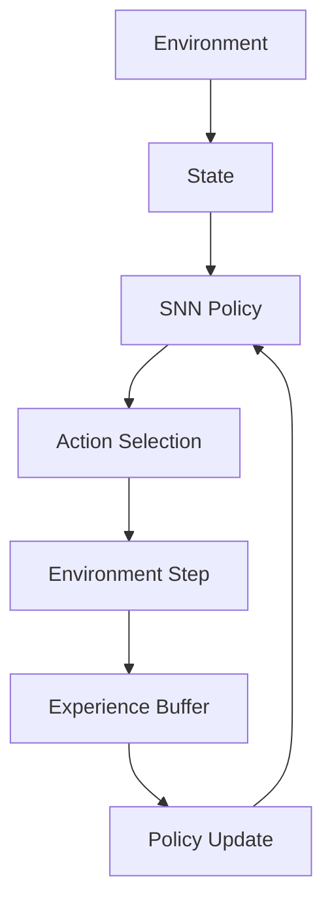
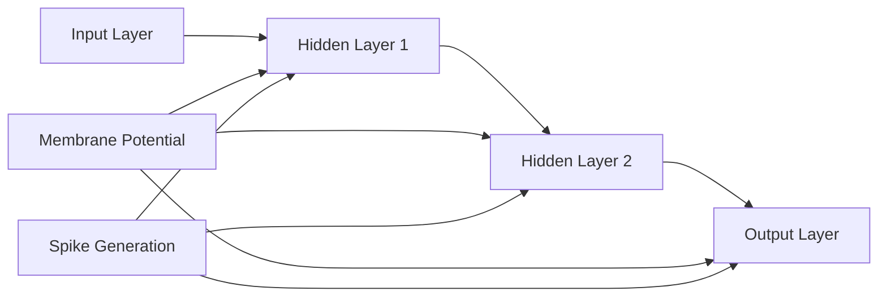

# RSNN Architecture Documentation

## Design Patterns

### 1. Factory Pattern
- Implementation: `models/policy_snn.py`
- Creates different SNN policies
- Supports multiple neuron types and architectures

### 2. Strategy Pattern
- Implementation: `agents/snn_agent.py`
- Interchangeable components:
  - Learning algorithms (REINFORCE, A2C)
  - Action selection strategies
  - Reward processing methods

### 3. Observer Pattern
- Implementation: `utils/logger.py` and `utils/visualizer.py`
- Real-time monitoring:
  - Training progress
  - Neural activity
  - Performance metrics
  - 3D visualizations

### 4. Command Pattern
- Implementation: `training/trainer.py`
- Encapsulates training operations
- Supports different training strategies
- Manages experiment workflows

## System Architecture

### Component Structure
```plaintext
RSNN/
├── agents/         # RL agent implementations
├── configs/        # Configuration management
├── environments/   # Environment wrappers
├── models/         # Neural implementations
├── training/       # Training logic
├── utils/         # Support utilities
└── results/       # Experiment outputs
```
### Data Flow
```plaintext
Environment → State → SNN Policy → Action → Environment
     ↑          ↓         ↓          ↓         ↓
     └──────── Reward ← Agent ← Experience ────┘
```
## Algorithms
### 1. Neural Network Models
- Spiking Neural Networks (SNN)
  - Leaky Integrate-and-Fire neurons
  - Membrane potential dynamics
  - Spike generation mechanisms
### 2. Reinforcement Learning
- Policy Gradient Methods
  - REINFORCE algorithm
  - Advantage estimation
  - Entropy regularization
### 3. Training Methods
- Experience Collection
- Policy Optimization
- Value Function Learning
- Spike-based Backpropagation

## Design Principles
### 1. SOLID Principles
- Single Responsibility: Each module has one purpose
- Open/Closed: Extensible for new algorithms
- Liskov Substitution: Interchangeable components
- Interface Segregation: Focused interfaces
- Dependency Inversion: Abstract dependencies
### 2. Clean Architecture
- Independent layers
- Dependency flow inward
- Business rules isolation
- Framework independence
### 3. Modularity
- Loose coupling
- High cohesion
- Reusable components
- Easy testing

## System Features
### 1. Extensibility
- New environments
- Custom policies
- Additional algorithms
### 2. Maintainability
- Clear structure
- Documentation
- Testing support
### 3. Scalability
- Multi-environment support
- Parallel training
- Resource management
### 4. Observability
- Detailed logging
- 3D visualization
- Performance metrics
- Real-time monitoring
## Detailed Algorithms

### Neural Network Components
1. Leaky Integrate-and-Fire (LIF) Neuron
   ```plaintext
   V(t) = β * V(t-1) + I(t)
   if V(t) > V_threshold:
       spike = 1
       V(t) = V_reset
   else:
       spike = 0
   ```
2. REINFORCE Algorithm Implementation
```plaintext
1. Collect trajectories τ = (s₀, a₀, r₀, ..., sₜ)
2. Calculate returns R(τ) = Σᵢ γⁱrᵢ
3. Update policy: θ ← θ + α∇log π(aₜ|sₜ)R(τ)
4. Apply entropy regularization: H(π) = -Σ π(a|s)log π(a|s)
```
## Extended Design Patterns
### Factory Pattern Implementation
```python
class SNNFactory:
    @staticmethod
    def create_policy(policy_type, config):
        if policy_type == "LIF":
            return LIFPolicy(config)
        elif policy_type == "Alpha":
            return AlphaPolicy(config)
```
### Strategy Pattern Example
```python
class ActionStrategy:
    def select_action(self, policy_output):
        pass

class EpsilonGreedy(ActionStrategy):
    def select_action(self, policy_output):
        if random.random() < self.epsilon:
            return random_action()
        return policy_output.argmax()
```

## System Diagrams
### Training Pipeline

### Neural Architecture


### Data Processing Flow
